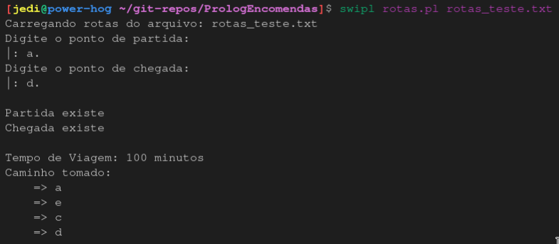

# README

## Prerequisitos para execução do programa:
1. Verificar se o compilador `swipl` se encontra instalado e com seu executável nas variáveis de sistema.

## Instruções para execução do programa:
1. Executar o programa

    Execute o programa na linha de comando com os seguintes argumentos:

        swipl rotas.pl rotas_teste.txt

    Em que `rotas.pl` é o arquivo com o código fonte e `rotas_teste.txt` é o arquivo com as regras contendo as distâncias entre as cidades.

2. Inserir Partida e Chegada

    Insira no programa conforme for indicado o nó de partida e chegada respectivamente.

    OBS: De acordo com as convenções do Prolog deve-se inserir um "`.`" após a entrada.

Exemplo:

