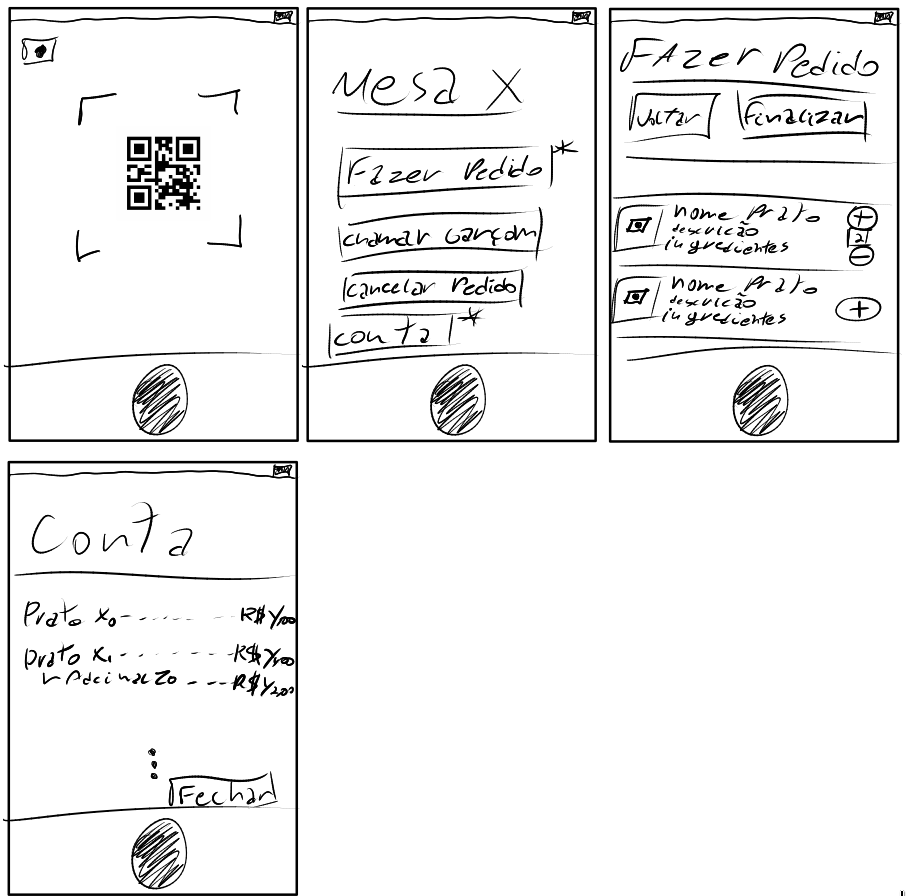

# Trabalho 2 - ESI

## Estudo de Caso 4 - RESTAURANTE
Um restaurante precisa melhorar o atendimento a cliente.
Ele já possui instalações agradáveis e garçons treinados,
entretanto, numa pesquisa realizada, descobriu-se que os clientes tem dificuldade em escolher opções dos pratos “a la carte”,
consideram que o tempo de escolha do prato e o tempo de realizar o pedido é demorado.
Numa análise, maior, revelou-se que em dias de restaurante cheio, a uma certa demora para que o garçon dê o primeiro atendimento.

## Proposta de Solução

Para os problemas abaixo:

1. Considerando o enunciado como um StakeHolder Request, elicite necessidades.
   - Um restaurante precisa melhorar o atendimento a cliente;
   - Melhorar a experiência de escolha de pratos “a la carte”;
   - Diminuir o tempo ocioso dos serventes (esperando o pedido dos clientes).

2. A partir dos itens A e B elicite os principais requisitos (que darão origem as principais funcionalidades/casos de uso).
   - RF0001: Login na wifi/sistema de pedidos;
   - RF0002: Apresentação do cardápio com informações detalhadas dos pratos;
   - RF0003: Requisição de atendimento pelo garçom.
   - RF0004: Requisitar fechamento de conta.
   - RNF0001: Feito a partir da tecnologia de beacons de wifi;
   - RNF0002: Utiliza códigos QR para aumentar a conveniência ao cliente;
   - RI0001: Não se podem realizar pedidos fora do cardápio;
   - RI0002: Não se pode ser feito login no QR code por mais de um aparelho;
   - RI0003: Não pode ser a única forma de realização do pedido.

3. Protótipos de telas:
   - 

4. Tempo de desenvolvimento (iteração/sprint)
   - RF0001 demoraria 1 semana com sprints a cada 2 dias;
   - RF0002 demoraria 1 semana com sprints a cada 2 dias;
   - RF0003 demoraria 1 semana com sprints a cada 2 dias;
   - RF0004 demoraria 1 semana com sprints a cada 2 dias;
   - 1 semana de testes e debugging;
   - Tempo final de desenvolvimento estimado: 5 semanas;

